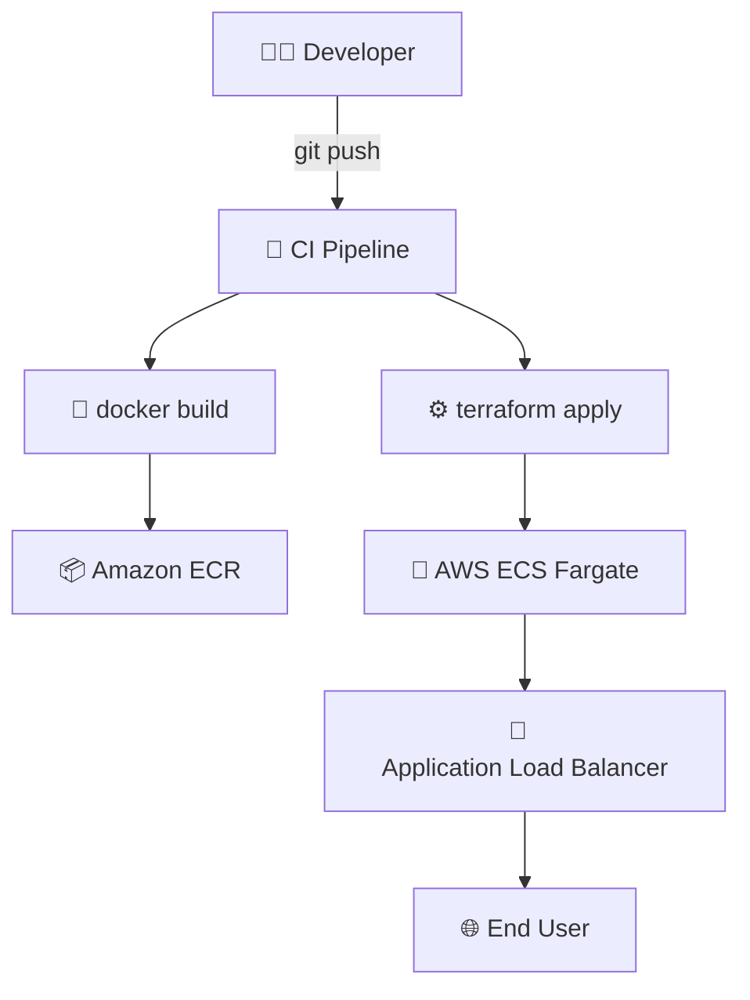

# 🐾 PokéTerraform  ⚙️🐳

> **Terraform + Docker reference project that spins up a containerized PokéAPI stack on AWS in minutes.**


---

## 🌟 Table of Contents

1. [Project Overview](#-project-overview)
2. [Architecture](#-architecture)
3. [Quick Start](#-quick-start)
4. [Local Development](#-local-development)
5. [Terraform Workflows](#-terraform-workflows)
6. [Environment Variables](#-environment-variables)
7. [Build & Deploy](#-build--deploy)
8. [Testing](#-testing)
9. [Cleanup](#-cleanup)
10. [Contributing](#-contributing)
11. [License](#-license)

---

## 🔍 Project Overview

This repo packages the open‑source [PokéAPI](https://pokeapi.co/) inside a Docker container and provisions the full runtime on AWS using Terraform **0.15+**. It is meant to be an opinionated, end‑to‑end reference that demonstrates:

* **Infrastructure‑as‑Code** (Terraform) for reproducible cloud environments.
* **Containerization** (Docker) for streamlined packaging & portability.
* **CI/CD ready** layout that you can drop into GitHub Actions, GitLab CI or Jenkins.
* **Minimal AWS footprint** (ECR → ECS → ALB) with sensible defaults & cost controls.

> **Why?** Using Pokémon data makes infra demos fun while still covering real‑world patterns 😉.

---

## 🗺️ Architecture



**Data flow**

1. Code pushes trigger the CI pipeline.
2. Pipeline builds & pushes a versioned Docker image to **Amazon ECR**.
3. `terraform apply` creates/updates the ECS service referencing that image.
4. A public **ALB** fronts the service, routing traffic from users to containers running the PokéAPI.

---

## ⚡ Quick Start

```bash
# Clone & enter the project
$ git clone git@github.com:your‑org/PokemonTerraformDocker.git
$ cd PokemonTerraformDocker

# One‑liner bootstrap (Docker + Terraform + AWS profile required)
$ make bootstrap
```

> Within \~5 minutes you’ll have a live endpoint like `https://pokeapi.your-domain.com/api/v2/pokemon/25`.

---

## 🛠️ Local Development

```bash
# Spin up a local container
$ docker compose up --build

# Sample query (with jq to pretty‑print)
$ curl -s http://localhost:8000/api/v2/pokemon/1 | jq .name
"bulbasaur"
```

Containers hot‑reload on file changes courtesy of **docker‑compose watch**.

---

## 🪄 Terraform Workflows

| Command                               | What it does                              |
| ------------------------------------- | ----------------------------------------- |
| `terraform init`                      | Downloads providers & sets up the backend |
| `terraform plan -var-file=dev.tfvars` | Shows diff for *dev* environment          |
| `terraform apply -auto-approve`       | Creates / updates the stack               |
| `terraform destroy`                   | Destroys all managed resources            |

State is stored remotely in **Amazon S3** with locking via **DynamoDB**.

---

## 🔧 Environment Variables

| Name                   | Default     | Description                               |
| ---------------------- | ----------- | ----------------------------------------- |
| `AWS_PROFILE`          | default     | AWS CLI profile with required permissions |
| `AWS_REGION`           | us-east-1   | Region to deploy to                       |
| `TF_VAR_domain_name`   | example.com | Root domain for the ALB record            |
| `COMPOSE_PROJECT_NAME` | poke        | Docker Compose project prefix             |

Create a `.env` (ignored) or export vars inline.

---

## 🚀 Build & Deploy

```bash
# Build & push container
$ docker build -t $AWS_ACCOUNT_ID.dkr.ecr.$AWS_REGION.amazonaws.com/pokeapi:$(git rev-parse --short HEAD) .
$ docker push $AWS_ACCOUNT_ID.dkr.ecr.$AWS_REGION.amazonaws.com/pokeapi:$(git rev-parse --short HEAD)

# Provision / update infra
$ terraform workspace select dev || terraform workspace new dev
$ terraform apply -var-file=dev.tfvars
```

After Terraform completes, open the **Outputs** section for the `alb_endpoint` URL.

---

## 🧪 Testing

```bash
# Smoke test the healthcheck
$ curl -f $(terraform output -raw alb_endpoint)/health || echo "Healthcheck failed!"

# Run full test-suite (uses bats‑core)
$ make test
```

---

## 🧹 Cleanup

```bash
$ terraform destroy -var-file=dev.tfvars
$ aws ecr batch-delete-image --repository-name pokeapi --image-ids imageTag=$(git rev-parse --short HEAD)
```

This stops billing for AWS compute & storage.

---

## 🤝 Contributing

Pull requests are welcome! Please open an issue first to discuss big changes.

1. Fork the repo & create your branch.
2. Commit descriptive messages.
3. Ensure `make test` passes.
4. Submit a PR 🥳.

---

## 📄 License

Distributed under the **MIT License**. See `LICENSE` for more information.
