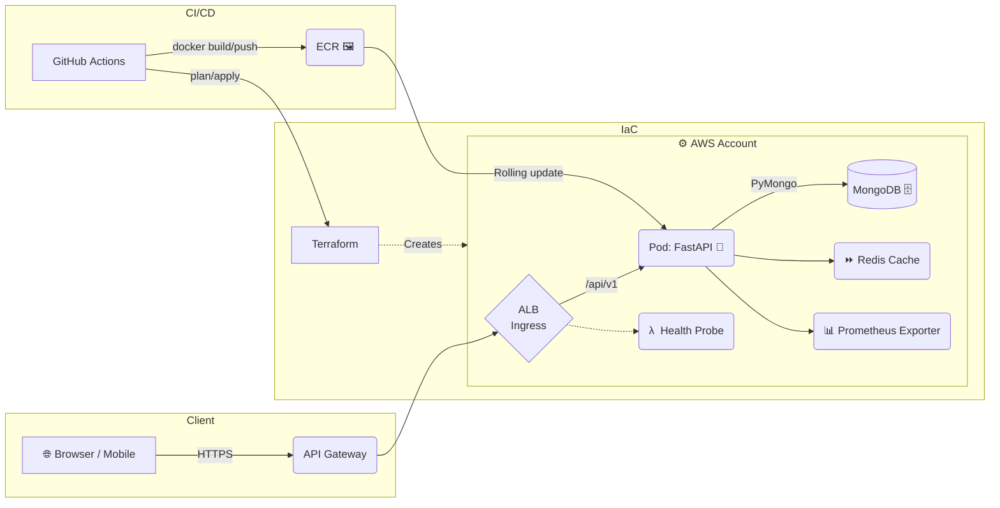

# Pokémon Terraform & Docker 🐳⚙️


> **One repo to rule your Pokémon micro‑service – from local development all the way to production on AWS.**  
> Terraform builds the cloud, Docker packs the bits, FastAPI + MongoDB deliver the magic.

---

## ✨ Key Capabilities

| Area | Highlights |
|------|------------|
| **Infrastructure‑as‑Code** | Reproducible AWS environment (VPC, EKS/ECS, ALB, IAM, Secrets Manager, Route 53) in a single `terraform apply` |
| **Containerisation** | Production‑ready multi‑stage Dockerfile – tiny, secure images with SBOM & provenance (SLSA‑level 3) |
| **API** | Blazing‑fast [**FastAPI**](https://fastapi.tiangolo.com/) service exposing Pokémon CRUD + search |
| **Data Layer** | Managed **MongoDB Atlas** (or self‑hosted in‑cluster) with change‑stream events |
| **CI/CD** | GitHub Actions → Terraform Cloud / Atlantis → ECR → EKS rolling deploy with zero‑downtime |
| **Dev Experience** | One‑command `make dev` spins up the full stack in Docker Compose incl. hot‑reload & seeded data |
| **Observability** | OpenTelemetry traces, Prometheus metrics & Loki logs pre‑wired and shipped to Grafana Cloud |
| **Quality** | 100 % typed, unit + e2e tests, pre‑commit hooks, rate‑limit, request validation & security headers |

---

## 🗺️ High‑Level Flow Map



---

## 🏗️ Project Layout

```text
.
├── terraform/          # All modules & stacks (prod, staging, dev)
│   ├── main.tf
│   └── ...
├── app/                # FastAPI application
│   ├── core/
│   ├── api/
│   └── models/
├── scripts/            # Helper scripts (migrations, seeding, tooling)
├── docker/
│   ├── Dockerfile
│   └── compose.yaml
└── tests/              # Unit & integration tests (pytest + httpx)
```

---

## 🚀 Getting Started

### 1 — Prerequisites

| Tool | Version | Notes |
|------|---------|-------|
| **Terraform** | `>= 1.6` | Cloud & CLI |
| **Docker Desktop** | `>= 24` | Linux: engine + docker‑compose plugin |
| **Python** | `>= 3.10` | `pyenv` recommended |
| **AWS CLI** | `>= 2.15` | Auth via SSO / IAM user |
| **kubectl** | matching EKS version | auto‑installed by `make eks-login` |

### 2 — Clone & Configure

```bash
git clone https://github.com/your-org/PokemonTerraformDocker.git
cd PokemonTerraformDocker
cp .env.example .env      # fill in 🔑  secrets
make venv                 # create + activate virtual‑env
```

### 3 — Local Dev Stack

```bash
make dev
```

This spins up:

* FastAPI on <http://localhost:8000>
* Swagger UI at `/docs`
* Hot‑reloading thanks to **uvicorn[reload]**
* MongoDB, Redis, Prometheus & Grafana pre‑wired

### 4 — Provision AWS

```bash
cd terraform/environments/dev
terraform init
terraform apply
```

Terraform will:

1. create an isolated VPC  
2. spin an EKS cluster + node groups  
3. push Secrets to AWS Secrets Manager  
4. deploy workload via Helm chart (post‑apply hook)

> **Tip:** use [Terraform Cloud](https://app.terraform.io/) or Atlantis for team workflows.

### 5 — Deploy Container

```bash
make build push deploy
```

The helper will build with BuildKit, push to ECR, patch the K8s Deployment and wait for rollout.

---

## 🔍 Deep Dive

### Infrastructure Modules

| Module | Resources |
|--------|-----------|
| **network** | VPC, public/private subnets, IGW, NAT, route tables |
| **eks-cluster** | EKS control‑plane, IAM OIDC provider, managed node groups |
| **k8s-addons** | Load Balancer Controller, External DNS, Cert‑Manager, Cluster Autoscaler |
| **data‑store** | MongoDB Atlas project & cluster via HashiCorp MongoDB Atlas provider |

### API Breakdown

* **/pokemon** `GET /{id}` `POST /` `PUT /{id}` `DELETE /{id}`
* **/search** filter by type, abilities, generation, regex name  
* Automatic **OpenAPI 3.1** schema & ReDoc docs  

Security is enforced with **JWT Bearer** tokens generated by Cognito.

---

## 🧭 Roadmap

- [ ] gRPC streaming endpoint for real‑time battle simulations  
- [ ] Canary deployments via Argo Rollouts  
- [ ] Switch to **MongoDB 6.0 Time‑Series** collections for analytics  

---

## ❤️ Contributing

PRs are welcome! Please run `pre-commit run --all-files` before opening any pull request.

---

## 🛡️ License

Distributed under the **MIT License**. See `LICENSE` for more information.

---

> _“Gotta deploy ’em all!”_ – The DevOps Pikachu

