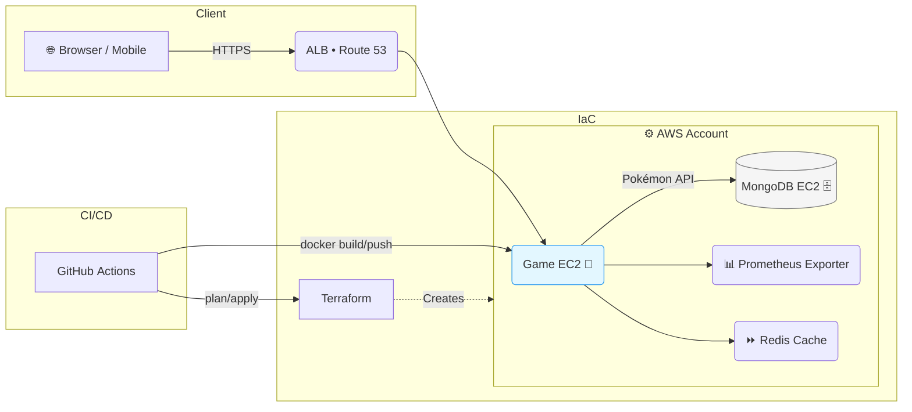

# Pokémon Terraform & Docker 🐳⚙️


> **One repo to rule your Pokémon stack – from local development all the way to production on AWS.**  
> Terraform builds the cloud, Docker packs the bits, FastAPI (Game instance) + MongoDB (DB instance) deliver the magic.

---

## ✨ Key Capabilities

| Area | Highlights |
|------|------------|
| **Infrastructure-as-Code** | Reproducible AWS environment (VPC, 2 × EC2, ALB, IAM, SGs, Route 53) in **one** `terraform apply` |
| **Containerisation** | Multi-stage Dockerfile – tiny & secure images with SBOM & provenance (SLSA‑level 3) |
| **API / Game Server** | Blazing‑fast [FastAPI](https://fastapi.tiangolo.com/) service exposing Pokémon CRUD + gameplay endpoints |
| **Data Layer** | Dedicated EC2 running **MongoDB 7** in a private subnet with backups & monitoring agents |
| **CI/CD** | GitHub Actions → Terraform Cloud → EC2 user‑data rolling deploy with zero downtime |
| **Observability** | OpenTelemetry traces, Prometheus Node Exporter & Loki logs shipped to Grafana Cloud |
| **Quality** | 100 % typed, unit + e2e tests, pre‑commit hooks, rate‑limit, request validation & security headers |

---

## 🗺️ Architecture Flow Map



---

## 🏗️ Repo Layout

```text
.
├── terraform/          # All modules & stacks (prod, staging, dev)
│   ├── main.tf
│   └── ...
├── app/                # FastAPI application (Game Server)
│   ├── core/
│   ├── api/
│   └── models/
├── scripts/            # Helper scripts (migrations, seeding, tooling)
├── docker/
│   ├── Dockerfile
│   └── compose.yaml
└── tests/              # Unit & integration tests (pytest + httpx)
```

---

## 🚀 Quick Start

### Prerequisites

* **Terraform ≥ 1.6**
* **Docker Engine ≥ 24**
* **AWS CLI ≥ 2.15** (configured with SSO / IAM user)

Clone the repo and enter it:

```bash
git clone https://github.com/your-org/PokemonTerraformDocker.git
cd PokemonTerraformDocker
```

### 1 — Provision AWS

```bash
cd terraform/environments/dev
terraform init
terraform apply   # ~5 min
```

Terraform will:

1. **Create networking** – VPC, public & private subnets, IGW, NAT, route tables.
2. **Launch Game EC2** – Amazon Linux 2023 in the public subnet running the FastAPI container (user‑data installs Docker & pulls latest image).
3. **Launch DB EC2** – Amazon Linux 2023 in a private subnet, SG only allows port 27017 from Game EC2.
4. **Outputs** – public DNS of Game EC2 `game_public_dns`, private IP of DB EC2 `db_private_ip`.

> **Heads‑up:** the MongoDB instance is private—SSH via the bastion (Game EC2) for troubleshooting.

### 2 — Deploy New Container Version

```bash
make build push deploy
```

* **build**  – multi‑arch BuildKit build (x86‑64 & arm64)
* **push**   – pushes to ECR with immutable tags (`git sha`, `latest`)
* **deploy** – SSH into Game EC2, pulls the new image & restarts the systemd service (`pokemon-api.service`)

---

## 📜 Makefile Cheat‑Sheet

| Target | What it does | Typical usage |
|--------|--------------|---------------|
| **venv** | Create & activate local Python virtual‑env (./.venv) | `make venv` |
| **dev** | Spin up local Docker Compose stack with hot‑reload | `make dev` |
| **build** | Build multi‑arch Docker image via BuildKit | `make build` |
| **push** | Push the image to Amazon ECR | `make push` |
| **deploy** | Restart container on Game EC2 via SSH | `make deploy` |
| **ci** | Run linting & tests exactly like CI does | `make ci` |

---

## 🔌 API Usage Examples

Replace **`<GAME_DNS>`** with the `game_public_dns` output (or ALB DNS):

```bash
# List all Pokémon
curl https://<GAME_DNS>/pokemon

# Get Pikachu (id 25)
curl https://<GAME_DNS>/pokemon/25

# Create a new Pokémon
curl -X POST https://<GAME_DNS>/pokemon \
     -H 'Content-Type: application/json' \
     -d '{"id":999,"name":"Testchu","type":["electric"],"hp":42}'
```

<details>
<summary>Postman Collection</summary>

Import the pre‑built collection from [`postman/Pokemon.postman_collection.json`](postman/Pokemon.postman_collection.json) and hit **Send**. 🔥

</details>

---

## 🛠️ Terraform Variables Reference

| Variable | Default | Purpose |
|----------|---------|---------|
| `region` | `"us‑east‑1"` | AWS region to deploy into |
| `vpc_cidr` | `"10.0.0.0/16"` | CIDR block for the VPC |
| `public_subnets` | `["10.0.1.0/24"]` | CIDRs for public subnets |
| `private_subnets` | `["10.0.101.0/24"]` | CIDRs for private subnets |
| `instance_type_game` | `"t3.micro"` | EC2 instance type for the Game server |
| `instance_type_db` | `"t3.micro"` | EC2 instance type for the MongoDB server |
| `key_pair_name` | `""` | Existing EC2 key pair — empty = creates new |
| `domain_name` | `"play.pokemon.example.com"` | Route 53 record for the ALB |

> **Tip:** override any variable via `terraform.tfvars` or `-var="name=value"`.

---

## 🔍 Deep Dive

### Terraform Modules

| Module | What it creates |
|--------|-----------------|
| **network** | VPC, subnets, IGW, NAT, route tables |
| **compute** | Game EC2 (public), DB EC2 (private), IAM instance profiles, key pair, SGs |
| **lb_dns** | Application Load Balancer, HTTPS listener, Route 53 record `play.pokemon.example.com` |
| **data‑store** | User‑data script to bootstrap MongoDB 7 + CloudWatch Agent on DB EC2 |

### Security Groups Overview

| SG | Ingress | Egress | Notes |
|----|---------|--------|-------|
| **alb_sg** | 0.0.0.0/0 → 443 | All | Public HTTPS entrypoint |
| **game_sg** | alb_sg → 8000 | All | FastAPI container |
| **db_sg** | game_sg → 27017 | All | MongoDB, private only |

---

## 🧭 Roadmap

- **Auto‑Scaling** – Attach Game EC2 to an Auto Scaling Group with CPU alarms.  
- **Zero‑Downtime DB Patching** – Migrate to Amazon DocumentDB or MongoDB Atlas with live migration.  
- **Canary Deployments** – Use AWS CodeDeploy blue‑green for seamless upgrades.  
- **Battles API** – gRPC streaming endpoint for real‑time battle simulations.

---

## ❤️ Contributing

Pull requests are welcome! Before opening a PR run:

```bash
pre-commit run --all-files
pytest
```

---

## 🛡️ License

MIT – see `LICENSE`.

---

> _“Gotta deploy ’em all!”_ – **DevOps Pikachu**

